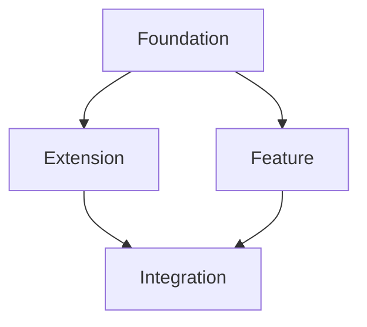

# CMOS Playbook (Phases 1–3)

_Last updated: 2025-10-31 02:20:47_

This consolidated guide merges Phase 1 (Foundation),Phase 2 (Mission Planning), and Phase 3 (Session Execution) into a single file. All file paths are normalized to the `cmos/` prefix, and the flow relies on `cmos/missions/backlog.yaml`, `cmos/PROJECT_CONTEXT.json`, and optional `cmos/SESSIONS.jsonl` (no `current.yaml`, no AI handoff).

---


# Getting Started with CMOS

## What is CMOS?

**CMOS** (Context + Mission Orchestration System) is an AI-agent-powered framework for building products through structured, session-based development. Rather than traditional time-based planning, CMOS organizes work into missions and sprints that can be executed by AI agents in modular sessions.

## Overview

The CMOS process is divided into phases. This guide covers **Phase 1: Foundation**, where you establish the core documents that will guide your entire project.

## Prerequisites

Before starting Phase 1, you must have:

- **Validated research and assumptions** about your product idea
- Sufficient understanding of the problem space to make informed architectural decisions
- Clear vision of what you're building and why

> **Note:** Research and validation are currently out of scope for CMOS. This system assumes you've already done the groundwork to understand your market, users, and technical feasibility.

---

structure

```
cmos
    ├── context
    │   └── MASTER_CONTEXT.json
    ├── docs
    │   ├── technical_architecture.md
    │   ├── roadmap.md
    ├── missions
    │   ├── backlog.yaml
    │   ├── research
    │   ├── sprint-00
    │   │   
    │   └── templates
    │       ├── Build.Implementation.v1.yaml
    │       └── Build.TechnicalResearch.v1.yaml
    ├── PROJECT_CONTEXT.json
    ├── reports
    └── SESSIONS.jsonl
```

## Phase 1: Foundation

**Goal:** Create the two foundational documents that will guide all subsequent development.

### The Two Core Documents

1. **`roadmap.md`** - Your project timeline, milestones, and success metrics
2. **`technical_architecture.md`** - Your technical implementation plan and system design

These documents serve as the "source of truth" for your project. As your build progresses and your vision evolves, you'll update these documents to reflect pivots, new learnings, and changing priorities.

---

## Step-by-Step: Completing Phase 1

### Step 1: Review the Template Files

Both foundational documents have template examples in the `/docs` directory:

- `/docs/roadmap.md` - Example: Smart API Client Generator roadmap
- `cmos/docs/technical_architecture.md` - Example: OSS Health Monitor architecture

**Action Items:**
- [ ] Read both template files completely
- [ ] Note the structure and level of detail
- [ ] Identify which sections are most relevant to your project

### Step 2: Complete Your `roadmap.md`

Using the template as a guide, create your project roadmap.

**Key Sections to Include:**

1. **Executive Summary**
   - What you're building
   - Target timeline (in sprints, not calendar time)
   - Key success metrics

2. **Sprint Overview**
   - Break your project into logical sprints
   - Each sprint should have clear deliverables
   - Avoid calendar dates - use "Sprint 1", "Sprint 2", etc.

3. **Sprint-by-Sprint Breakdown**
   - Technical milestones for each sprint
   - Key decisions to be made
   - Success criteria
   - Dependencies between sprints

4. **Success Metrics**
   - How you'll measure progress at each sprint
   - Long-term goals (3-6 sprints out)
   - Leading indicators of success

5. **Risk Mitigation**
   - Technical risks and mitigation strategies
   - Market/business risks
   - Resource requirements

**Action Items:**
- [ ] Draft your executive summary
- [ ] Define your sprint structure (how many sprints to MVP?)
- [ ] Detail Sprint 1 completely
- [ ] Outline remaining sprints at high level
- [ ] Define success metrics for each sprint
- [ ] Document known risks and mitigation plans

### Step 3: Complete Your `technical_architecture.md`

Using the template as a guide, design your technical implementation.

**Key Sections to Include:**

1. **System Overview**
   - High-level architecture diagram (in text/ASCII or reference to image)
   - Core components and their relationships
   - Technology stack decisions

2. **Sprint-by-Sprint Implementation**
   - What gets built in each sprint
   - Technical dependencies
   - Service/component structure

3. **Data Architecture**
   - Database schemas
   - API structures
   - Data flow patterns

4. **Deployment Strategy**
   - Where and how you'll deploy
   - Environment setup
   - Infrastructure requirements

5. **Mission Planning Framework**
   - How work will be split into AI agent missions
   - Session-level planning approach
   - Parallel vs. sequential mission structure

**Action Items:**
- [ ] Define your core system architecture
- [ ] Map architecture to your roadmap sprints
- [ ] Document key technical decisions and rationale
- [ ] Identify which components can be built in parallel
- [ ] Plan your deployment approach
- [ ] Outline how Sprint 1 will be broken into missions

### Step 4: Cross-Validate Your Documents

Your roadmap and technical architecture should align perfectly.

**Validation Checklist:**
- [ ] Each roadmap sprint has corresponding technical detail
- [ ] Technical dependencies match roadmap sequence
- [ ] Success metrics are measurable with your architecture
- [ ] Resource requirements are realistic for your technical approach
- [ ] Sprint timelines align with architectural complexity
- [ ] Risk mitigation strategies are technically feasible

### Step 5: Review & Finalize

Before moving to Phase 2, ensure both documents are complete and coherent.

**Final Review Checklist:**
- [ ] Both documents are complete (no major TBD sections)
- [ ] Sprint 1 is detailed enough to begin mission planning
- [ ] Technical decisions are documented with rationale
- [ ] Success criteria are clear and measurable
- [ ] Documents are stored in `/docs` directory
- [ ] Both files are version controlled (recommended)

---

## What Happens After Phase 1?

Once your foundational documents are complete, you'll move to **Phase 2: Mission Planning**.

Phase 2 begins with a critical decision point:

**Question:** Does Sprint 1 require additional research to inform the technical build?

- **If YES** → Proceed to research sessions aimed at informing Sprint 1 build missions
- **If NO** → Proceed directly to creating `sprint-01_build.yaml`, which details all build missions for Sprint 1

### Understanding Mission-Based Planning

In CMOS, work is organized into:

- **Sessions** - Individual AI agent working periods (token-bounded)
- **Missions** - Specific pieces of work completed in one or more sessions
- **Sprints** - Groups of related missions that deliver meaningful project milestones

Missions can:
- Have dependencies on other missions
- Run in parallel when independent
- Be combined to complete a sprint

This avoids traditional time estimation issues and works naturally with AI agent workflows.
Missions should be created using the mission protocol system
---

## Tips for Success

### Start Specific, Stay Flexible

- Be highly detailed for Sprint 1
- Keep later sprints at a higher level
- Update documents as you learn and pivot

### Think in Missions

- When planning, ask: "Could an AI agent complete this in one session?"
- If no, break it down further
- If yes, that's a good mission scope

### Use Your Templates

- The example roadmap and architecture are realistic references
- Match their level of detail
- Adapt their structure to your domain

### Document Decisions

- Capture *why* you made technical choices
- Future you (or future AI agents) will need this context
- Rationale is as important as the decision itself

---

## Getting Help

Your foundational documents will be used by AI agents throughout the build process. The better detailed they are, the more effectively agents can:

- Understand project context
- Make aligned decisions
- Execute missions independently
- Maintain consistency across sprints

If you're unsure about any section, refer back to the template examples or consider whether additional research would help inform that area.

---

## Phase 1 Completion Checklist

You're ready to move to Phase 2 when:

- [ ] `roadmap.md` is complete with all sections filled out
- [ ] `technical_architecture.md` is complete with all sections filled out
- [ ] Sprint 1 is detailed in both documents
- [ ] Technical and roadmap documents are cross-validated
- [ ] You can clearly articulate what Sprint 1 will deliver
- [ ] You know whether Sprint 1 requires research or can proceed to build

**Next Step:** Determine if research is needed for Sprint 1, then proceed to Phase 2 documentation.


---


# Phase 2: Mission Planning

## Overview

**Goal:** Transform your foundational documents (roadmap.md and technical_architecture.md) into concrete, executable missions for Sprint 1.

Phase 2 is where planning becomes action. You'll create the folder structure and individual mission files that AI agents will execute in later phases.

---

## Prerequisites

Before starting Phase 2, you must have:

- [ ] Completed Phase 1 (both foundational documents finished)
- [ ] Sprint 1 clearly defined in both roadmap.md and technical_architecture.md
- [ ] Clear understanding of Sprint 1 deliverables

---

## Phase 2 Process

### Step 1: Create Sprint 1 Folder Structure

Set up the directory structure for Sprint 1 missions.

**Action Items:**
- [ ] Create `/missions/sprint-01/` directory
- [ ] Create `/missions/sprint-01/research/` subdirectory


```
missions/
└── sprint-01/
    ├── research/R1.1_Research_Mission_name.yaml
    └── B1.1_Build-Mission-Name.yaml
```

### Step 2: Decision Point - Research vs. Build

**Critical Question:** Does Sprint 1 need research to inform the build missions?

#### How to Decide

Ask yourself (or an AI assistant):
- Do I have sufficient technical details to begin building?
- Are there unknowns about algorithms, performance, or implementation approaches?
- Would targeted research help inform better technical decisions?
- Did my initial research leave gaps specific to Sprint 1 work?

**Common scenarios:**

**Research IS needed when:**
- Technical architecture has open questions or unknowns
- Sprint 1 involves unfamiliar technologies or patterns
- Performance requirements need validation
- Multiple implementation approaches need evaluation
- Integration patterns need investigation

**Research is NOT needed when:**
- Sprint 1 is boilerplate or well-understood setup
- Technical details are fully specified in architecture doc
- Prior research already covers all Sprint 1 needs
- Using established patterns or libraries

**Action Items:**
- [ ] Review your technical_architecture.md Sprint 1 section
- [ ] Identify any unknowns or open questions
- [ ] Make the decision: Research first, or proceed to build?

### Step 3A: If Research Needed - Create Research Missions

If you determined research is needed, create research missions that will inform your build missions.

#### Mission Naming Convention

Research missions are numbered sequentially:
- `R1.1_[topic].md` - First research mission
- `R1.2_[topic].md` - Second research mission
- `R1.3_[topic].md` - Third research mission
- etc.

#### Using the Research Template

Location: `/missions/templates/RESEARCH_TEMPLATE.md`

**For each research mission:**

1. **Copy the template** to `/missions/sprint-01/research/R1.#_[topic].md`
2. **Fill in Mission Metadata**
   - Estimated tokens (5k-25k recommended)
   - AI system you'll use
   - Parallel tracks (other missions running simultaneously)
   - Dependencies (previous missions this builds on)

3. **Define Research Objectives**
   - 3-5 specific questions that fit within a single session
   - Focus on quantitative, qualitative, feasibility, and technical depth
   - Keep scope to what can be answered in one session

4. **Plan Token Budget**
   - Initial prompt with context: ~2k tokens
   - Research queries: ~3k tokens
   - Response space: ~15-20k tokens
   - Follow-up refinements: ~5k tokens

5. **Define Success Criteria**
   - What specific insights will enable build missions?
   - What performance metrics need to be discovered?
   - What implementation patterns need to be documented?

**Example Research Missions for Sprint 1:**
```
R1.1_algorithm_selection.md     - Which algorithm/approach to use?
R1.2_performance_benchmarks.md  - What are realistic performance targets?
R1.3_integration_patterns.md    - How should components integrate?
```

#### Research Synthesis (Optional)

For complex research efforts, you may want to create a synthesis document that consolidates findings across multiple research missions. This is context-dependent and most valuable when:
- You have 3+ research missions with overlapping insights
- Findings need to be cross-validated
- Multiple build missions will reference the same research

**If creating synthesis:**
- Create `/missions/research/RS1.1_SYNTHESIS-Topic.md`
- Consolidate key findings from all R1.# missions
- Document consensus findings across different research
- Resolve any contradictions
- Extract actionable insights for build missions

**Action Items (if research needed):**
- [ ] Identify n research topics for Sprint 1
- [ ] Create R1.1, R1.2, R1.3... mission files using mission protocol template
- [ ] Sythensize research missions and use findings to guide build implementation details
- [ ] Determine if contextual examples, cross-referenced files or additional contextual files are needed, cross link to research in cmos/missions/research/

### Step 3B: If No Research Needed - Skip to Build Planning

If your Sprint 1 technical details are fully specified, proceed directly to creating build missions (Step 4).

### Step 4: Create Build Missions

Create the build mission files that will implement Sprint 1 deliverables.

#### Mission Naming Convention

Build missions are numbered sequentially:
- `B1.1_[component].yaml` - First build mission
- `B1.2_[component].yaml` - Second build mission
- `B1.3_[component].yaml` - Third build mission
- etc.

#### Using the Build Template

Location: `/missions/templates/Build.Implementation.v1.yaml

**For each build mission:**

1. **Copy the template** to `/missions/sprint-01/build/B1.#_[component].yaml`

2. **Fill in Mission Metadata**
   - Estimated tokens (10k-30k recommended per session)
   - Complexity (Low/Medium/High)
   - Dependencies (previous missions required - can be research or other build missions)
   - Enables (future missions this unblocks)

3. **Plan Token Budget**// this is covered by Mission prtocol
   ```yaml
   context_load:
     project_context: 2k
     previous_code: 3k
     research_findings: 2k
   
   generation_budget:
     implementation: 15k
     tests: 5k
     documentation: 3k
   
   validation_reserve: 5k
   total_estimated: 35k
   ```

4. **Reference Research Foundation** (if applicable)
   
   Link to research missions that inform this build:
   ```markdown
   ## Research Foundation
   Applied findings from research missions:
   - **R1.1**: [Specific algorithm/pattern to implement]
   - **R1.2**: [Performance target to meet]
   - **R1.3**: [Constraint to respect]
   ```
   
   **Example with file path reference:**
   ```markdown
   ## Research Foundation
   - **R1.1**: Please review algorithm research here: 
     `/missions/sprint-01/research/R1.1_algorithm_selection.md`
   - **R1.2**: Performance benchmarks documented here:
     `/missions/sprint-01/research/R1.2_performance_benchmarks.md`
   ```

5. **Define Implementation Scope**
   - Core deliverable for THIS session
   - What's explicitly out of scope (for future missions)
   - Keep scope to what fits in one session

6. **Set Success Criteria**
   - Core functionality checkpoints
   - Test coverage requirements
   - Performance baselines
   - Documentation completeness

7. **Create Implementation Checklist**
   - Essential (This Session) - must complete
   - Deferred (Next Mission) - explicitly postponed

#### Mission Sizing Guidelines

**Split this mission if:**
- Estimated tokens > 40k
- Multiple unrelated components
- Can't complete in one session
- Dependencies not ready

**Combine with next if:**
- Under 10k tokens estimated
- Tightly coupled logic
- Same test suite
- Minimal context switch

**Action Items:**
- [ ] Break down Sprint 1 into individual build missions
- [ ] Create B1.1, B1.2, B1.3... mission files using template
- [ ] Fill out all sections of each build mission
- [ ] Cross-reference any research missions in dependencies
- [ ] Verify each mission is properly scoped for single session
- [ ] Document what each mission enables for future work

### Step 5: Map Dependencies and Sequence

While parallelization is optional, understanding dependencies helps with planning.

**Dependency Mapping:**

For each mission (research and build), document:
- **Dependencies**: What must be completed before this mission?
- **Enables**: What does this mission unlock?

**Example dependency chain:**
```
R1.1 (Algorithm Research)
  ↓
B1.1 (Core Implementation) ← depends on R1.1
  ↓
B1.2 (Tests) ← depends on B1.1
  ↓
B1.3 (Integration) ← depends on B1.1, B1.2

R1.2 (Performance Research) ← can run parallel to B1.1
  ↓
B1.4 (Optimization) ← depends on B1.1, B1.2, R1.2
```

**Notes on Parallelization:**
- Parallelization is optional - you can execute all missions sequentially
- Human manages dependencies outside the system
- If you have team/capacity, missions without dependencies can run simultaneously
- Most individual builders will execute missions one at a time

**Action Items:**
- [ ] Review dependencies field in all mission files
- [ ] Verify logical sequence makes sense
- [ ] Identify which missions (if any) could run in parallel
- [ ] Document the intended execution order

### step 5.1 Initialize Backlog

The backlog captures all missions for the current sprint at a glance.

**Create `/missions/backlog.yaml`:**

```yaml
# backlog.yaml - Sprint Plan Metadata
name: "Planning.SprintPlan.v1"
version: "1.0.0"
displayName: "Sprint Plan Orchestrator"
description: "Master backlog tracking all sprints, missions, and dependencies"
author: "Your Name/Team"
schema: "./schemas/SprintPlan.v1.json"

---

# Mission File: project-main-backlog.yaml

missionId: "SP-MAIN-001"

objective: "To successfully track, manage, and complete all planned development sprints from foundation through final delivery."

context: |
  This mission file represents the master backlog and sprint plan for the [Your Project Name] project.
  It provides a single source of truth for what has been completed, what is in progress, and what is planned.
  This structured format allows for automated status tracking and dependency management.

successCriteria:
  - "All missions within the current sprint are moved through 'Current' to 'Completed' status."
  - "Sprint transitions are properly documented with learnings captured."

deliverables:
  - "A fully updated version of this mission file with accurate sprint and mission status."

domainFields:
  type: "Planning.SprintPlan.v1"

  sprints:
    # Completed Sprints (example structure)
    - sprintId: "Sprint 1"
      title: "Foundation - [Your Sprint Theme]"
      focus: "[Brief description from roadmap]"
      status: "Completed"
      missions:
        - { id: "B1.1", name: "[Component Name]", status: "Completed" }
        - { id: "B1.2", name: "[Component Name]", status: "Completed" }
        - { id: "B1.3", name: "[Component Name]", status: "Completed" }

    # Current Sprint
    - sprintId: "Sprint N"
      title: "[Sprint Theme]"
      focus: "[Brief description from roadmap]"
      status: "In Progress"
      missions:
        - { id: "BN.1", name: "[Component Name]", status: "Current" }
        - { id: "BN.2", name: "[Component Name]", status: "Queued" }
        - { id: "BN.3", name: "[Component Name]", status: "Queued" }

    # Future Sprints
    - sprintId: "Sprint N+1"
      title: "[Next Sprint Theme]"
      focus: "[Brief description from roadmap]"
      status: "Planned"
      missions:
        - { id: "BN+1.1", name: "[Component Name]", status: "Planned" }
        - { id: "BN+1.2", name: "[Component Name]", status: "Planned" }

  # Mission Dependencies
  missionDependencies:
    - { from: "BN.1", to: "BN.2", type: "Blocks" }
    - { from: "BN.1", to: "BN.3", type: "Blocks" }
    - { from: "BN.2", to: "BN.4", type: "Blocks" }
    - { from: "BN.3", to: "BN.4", type: "Blocks" }

  # Sprint Success Metrics
  successMetrics:
    - "[Key metric from roadmap]"
    - "[Key metric from roadmap]"
    - "[Key metric from roadmap]"
```

**Key Points:**
- List ALL current sprint missions
- Mark completed missions with status "Completed"
- Mark first build mission as status "Current"
- Keep other missions as status "Queued"
- Include success metrics from roadmap

**Action Items:**
- [ ] Copy template above to `/missions/backlog.yaml`
- [ ] Fill in current sprint mission details from Phase 2
- [ ] Add mission dependency relationships
- [ ] List success metrics from roadmap.md


### Step 6: Cross-Validate Mission Plan

Ensure your missions align with your foundational documents and are properly scoped.

**Validation Checklist:**

**Alignment with Roadmap:**
- [ ] All Sprint 1 deliverables from roadmap.md are covered by missions
- [ ] Mission scope matches Sprint 1 complexity estimate
- [ ] Success criteria align with roadmap metrics

**Alignment with Architecture:**
- [ ] All Sprint 1 components from technical_architecture.md have build missions
- [ ] Research missions address architectural unknowns
- [ ] Mission sequence follows architecture build order

**Mission Quality:**
- [ ] Each mission is scoped for single session completion
- [ ] Token budgets are realistic (10k-40k per mission)
- [ ] Dependencies are clearly documented
- [ ] Success criteria are measurable
- [ ] Research missions have 3-5 specific questions
- [ ] Build missions reference relevant research

**Completeness:**
- [ ] All necessary research missions created
- [ ] All Sprint 1 components have build missions
- [ ] First mission has no dependencies (can start immediately)
- [ ] Last mission delivers complete Sprint 1 functionality

### Step 7: Finalize Sprint 1 Mission Plan

Review and prepare for execution.


**Final Checklist:**
- [ ] Sprint 1 folder structure is complete
- [ ] All research missions are done and properly referenced in the build mission
- [ ] All build missions are detailed and ready to execute
- [ ] Dependencies are clearly mapped
- [ ] Each mission uses the appropriate template
- [ ] Mission files are properly named (R1.#, B1.#)
- [ ] Cross-references between missions are accurate
- [ ] Token budgets are estimated for all missions
- [ ] Success criteria are defined for all missions

---

## What Happens After Phase 2?

Once your Sprint 1 missions are planned and documented, you'll move to **Phase 3: Session Execution**, where individual missions are executed by AI agents in single sessions.

Phase 3 will detail:
- How to execute a single research mission
- How to execute a single build mission
- Session-level process and validation
- Capturing results and updating mission status
- Transitioning between missions

---

## Tips for Effective Mission Planning

### Start with Research First
If in doubt about whether research is needed, err on the side of doing targeted research. A few focused research missions can save significant rework in build missions.

### Keep Missions Atomic
Each mission should deliver one complete thing. If a mission feels like it's doing multiple things, split it into multiple missions.

### Size Missions Conservatively
Better to have 8 well-scoped missions that succeed than 4 ambitious missions that overflow. You can always combine missions later, but splitting mid-session is disruptive.

### Document the "Why"
In both research and build missions, capture the reasoning behind decisions. This context is invaluable for later missions and future sprints.

### Reference, Don't Duplicate
Build missions should reference research missions by file path. Don't copy research findings into build missions - link to the source of truth.

### Think in Sessions
A "session" is a single AI agent working period. Plan missions around what can be accomplished in one focused session, not calendar time.

---

## Common Pitfalls to Avoid

### Pitfall 1: Mission Scope Creep
**Problem:** Missions expand beyond single session as you plan
**Solution:** Be ruthless about scope. Split missions early and often.

### Pitfall 2: Skipping Research
**Problem:** Building without sufficient technical detail, leading to rework
**Solution:** When in doubt, create a focused research mission.

### Pitfall 3: Unclear Dependencies
**Problem:** Can't determine what to execute next
**Solution:** Explicitly document dependencies in mission metadata.

### Pitfall 4: No Success Criteria
**Problem:** Can't determine when a mission is "done"
**Solution:** Define measurable success criteria before execution.

### Pitfall 5: Research Without Build Connection
**Problem:** Research missions that don't inform specific build missions
**Solution:** Each research mission should enable 1+ build missions.

---

## Phase 2 Completion Checklist

You're ready to move to Phase 3 when:

- [ ] `/missions/sprint-01/` directory structure exists
- [ ] All necessary research missions are created and detailed
- [ ] All necessary build missions are created and detailed
- [ ] Each mission file is complete (all template sections filled)
- [ ] Dependencies are mapped between missions
- [ ] Token budgets are estimated for all missions
- [ ] Success criteria are defined for all missions
- [ ] First mission (R1.1 or B1.1) is ready to execute
- [ ] You can explain what Sprint 1 will deliver via these missions

**Next Step:** Proceed to Phase 3 - Session Execution (individual mission execution process)


---

#### End-of-Sprint Current State Mission
For **every sprint (Sprint 1 and onward)**, the **final mission** must be a **Current State / End of Sprint** checkpoint.
- Capture a snapshot of the week's progress (what shipped, coverage deltas, open risks).
- Uncover issues or areas needing attention (blocked work, tech debt, governance gaps).
- Produce inputs for the following sprint planning (updated priorities, carry-over missions, new research items).

**Outputs (commit to repo):**
- `cmos/reports/sprint-XX-current-state.md` (narrative + metrics)
- Update `cmos/missions/backlog.yaml` (mark end-of-sprint mission Completed, queue next planning mission)
- Append an event to `cmos/SESSIONS.jsonl`

# Phase 3: Session Execution & Weekly Cycle

## Overview

**Goal:** Execute sprint missions through single-session workflow, with automated handoffs between missions and a systematic weekly cycle.

Phase 3 is where your planning becomes working software. You'll execute missions one session at a time, with the AI automatically updating documentation for seamless transitions. At the end of each sprint, you'll review progress and loop back to update your roadmap for the next sprint.

---

## Prerequisites

Before starting Phase 3, you must have:

- [ ] Completed Phase 2 (current sprint missions planned and documented)
- [ ] `/missions/sprint-XX/` folder structure exists
- [ ] All mission files created (R#.# and/or B#.#)
- [ ] First mission is ready to execute

---

## Phase 3 Overview

Phase 3 consists of three interconnected processes:

1. **Initial Sprint Setup** - Set up tracking files for the sprint (one-time per sprint)
2. **Session Execution** - Execute individual missions with automated handoffs (repeats per mission)
3. **Weekly Cycle** - Complete sprint, review roadmap, plan next sprint (repeats per sprint)

```
┌───────────────────────────────────────────────────────┐
│  Phase 1: Foundation (roadmap + architecture)       │
└──────────────────┬────────────────────────────────────┘
                   │
                   ▼
┌───────────────────────────────────────────────────────┐
│  Phase 2: Mission Planning (sprint missions)        │
└──────────────────┬────────────────────────────────────┘
                   │
                   ▼
┌───────────────────────────────────────────────────────┐
│  Phase 3: Session Execution                         │
│  ┌───────────────────────────────────────────────┐  │
│  │  1. Initial Sprint Setup (one-time)           │  │
│  └───────────────────────────────────────────────┘  │
│                    │                                 │
│                    ▼                                 │
│  ┌───────────────────────────────────────────────┐  │
│  │  2. Session Execution Loop                    │  │
│  │     - Execute mission                         │  │
│  │     - AI updates files for next mission       │  │
│  │     - Human verifies and continues            │  │
│  │     (Repeats for each mission in sprint)      │  │
│  └───────────────────────────────────────────────┘  │
│                    │                                 │
│                    ▼                                 │
│  ┌───────────────────────────────────────────────┐  │
│  │  3. Weekly Cycle                              │  │
│  │     - Sprint complete                         │  │
│  │     - Review roadmap (Phase 1)                │  │
│  │     - Plan next sprint (Phase 2)              │  │
│  │     - Loop back to Session Execution          │  │
│  └───────────────────────────────────────────────┘  │
└───────────────────────────────────────────────────────┘
```

---

## Part 1: Initial Sprint Setup

This is done **once per sprint** before executing any missions.

### Step 1: Create Sprint Tracking Files

You'll update **two core tracking files** that enable automated handoffs:

1. **`cmos/missions/backlog.yaml`** - Sprint-level mission tracking
2. **`cmos/PROJECT_CONTEXT.json`** - Machine-readable project state

**Optional but recommended:**
- **`cmos/SESSIONS.jsonl`** - Append-only event log for sessions and mission transitions

**Action Items:**
- [ ] Create `cmos/missions/backlog.yaml` if it doesn't exist
- [ ] Create `cmos/PROJECT_CONTEXT.json` if it doesn't exist
- [ ] (Optional) Create `cmos/SESSIONS.jsonl` if it doesn't exist

### Step 2: update Backlog


The backlog captures all missions for the current sprint at a glance.

**Create `/missions/backlog.yaml`:**

```yaml
# backlog.yaml - Sprint Plan Metadata
name: "Planning.SprintPlan.v1"
version: "1.0.0"
displayName: "Sprint Plan Orchestrator"
description: "Master backlog tracking all sprints, missions, and dependencies"
author: "Your Name/Team"
schema: "./schemas/SprintPlan.v1.json"

---

# Mission File: project-main-backlog.yaml

missionId: "SP-MAIN-001"

objective: "To successfully track, manage, and complete all planned development sprints from foundation through final delivery."

context: |
  This mission file represents the master backlog and sprint plan for the [Your Project Name] project.
  It provides a single source of truth for what has been completed, what is in progress, and what is planned.
  This structured format allows for automated status tracking and dependency management.

successCriteria:
  - "All missions within the current sprint are moved through 'Current' to 'Completed' status."
  - "Sprint transitions are properly documented with learnings captured."

deliverables:
  - "A fully updated version of this mission file with accurate sprint and mission status."

domainFields:
  type: "Planning.SprintPlan.v1"

  sprints:
    # Completed Sprints (example structure)
    - sprintId: "Sprint 1"
      title: "Foundation - [Your Sprint Theme]"
      focus: "[Brief description from roadmap]"
      status: "Completed"
      missions:
        - { id: "B1.1", name: "[Component Name]", status: "Completed" }
        - { id: "B1.2", name: "[Component Name]", status: "Completed" }
        - { id: "B1.3", name: "[Component Name]", status: "Completed" }

    # Current Sprint
    - sprintId: "Sprint N"
      title: "[Sprint Theme]"
      focus: "[Brief description from roadmap]"
      status: "In Progress"
      missions:
        - { id: "BN.1", name: "[Component Name]", status: "Current" }
        - { id: "BN.2", name: "[Component Name]", status: "Queued" }
        - { id: "BN.3", name: "[Component Name]", status: "Queued" }

    # Future Sprints
    - sprintId: "Sprint N+1"
      title: "[Next Sprint Theme]"
      focus: "[Brief description from roadmap]"
      status: "Planned"
      missions:
        - { id: "BN+1.1", name: "[Component Name]", status: "Planned" }
        - { id: "BN+1.2", name: "[Component Name]", status: "Planned" }

  # Mission Dependencies
  missionDependencies:
    - { from: "BN.1", to: "BN.2", type: "Blocks" }
    - { from: "BN.1", to: "BN.3", type: "Blocks" }
    - { from: "BN.2", to: "BN.4", type: "Blocks" }
    - { from: "BN.3", to: "BN.4", type: "Blocks" }

  # Sprint Success Metrics
  successMetrics:
    - "[Key metric from roadmap]"
    - "[Key metric from roadmap]"
    - "[Key metric from roadmap]"
```

**Key Points:**
- List ALL current sprint missions
- Mark completed missions with status "Completed"
- Mark first build mission as status "Current"
- Keep other missions as status "Queued"
- Include success metrics from roadmap

**Action Items:**
- [ ] Copy template above to `/missions/backlog.yaml`
- [ ] Fill in current sprint mission details from Phase 2
- [ ] Add mission dependency relationships
- [ ] List success metrics from roadmap.md


### Step 3: Initialize PROJECT_CONTEXT.json

This machine-readable file enables AI to track project state across sessions.

**Create `/PROJECT_CONTEXT.json`:**

```json
{
  "project_name": "[Your Project Name]",
  "version": "1.0.0",
  "created": "YYYY-MM-DD",
  "last_updated": "YYYY-MM-DD",
  
  "working_memory": {
    "active_domain": "[domain for first mission]",
    "session_count": 1,
    "last_session": "YYYY-MM-DD-sprint-N-start"
  },
  
  "domains": {
    "[domain_name]": {
      "status": "active",
      "priority": 1,
      "current_mission": "BN.1",
      "missions": {
        "BN.1": {
          "name": "[Mission Name]",
          "status": "in_progress",
          "started": "YYYY-MM-DD",
          "target_completion": "[estimated sessions]"
        },
        "BN.2": {
          "name": "[Mission Name]",
          "status": "queued"
        }
      },
      "critical_facts": [
        "[Key technical decision]",
        "[Performance target]",
        "[Constraint]"
      ],
      "constraints": [
        "[Technical constraint]",
        "[Resource constraint]"
      ],
      "decisions_made": [],
      "files_to_create": [
        "path/to/file1.ts",
        "path/to/file2.ts"
      ],
      "research_completed": [
        "missions/sprint-XX/research/RN.1_[topic].yaml"
      ],
      "achievements": []
    }
  },
  
  "mission_planning": {
    "current_mission": {
      "id": "BN.1",
      "name": "[Mission Name]",
      "sprint": "N",
      "status": "ready",
      "context_files": [
        "PROJECT_CONTEXT.json",
      ],
      "research": [
        "missions/sprint-XX/research/RN.1_[topic].yaml"
      ],
      "deliverables": [
        "[Key deliverable 1]",
        "[Key deliverable 2]"
      ]
    },
    "next_mission": {
      "id": "BN.2",
      "name": "[Next Mission]",
      "status": "queued"
    },
    "current_sprint_missions": {
      "BN.1": {
        "name": "[Mission Name]",
        "status": "in_progress",
        "priority": 1
      },
      "BN.2": {
        "name": "[Mission Name]",
        "status": "queued",
        "priority": 2
      }
    }
  },
  
  "current_sprint": {
    "sprint": "N",
    "phase": "Sprint N: [Theme]",
    "active_mission": "BN.1: [Mission Name]",
    "completed_missions": [],
    "queued_missions": [
      "BN.2: [Name]",
      "BN.3: [Name]"
    ],
    "blockers": [],
    "next_milestone": "Sprint N+1: [Next Theme]"
  },
  
  "ai_instructions": {
    "context_priority": [
      "PROJECT_CONTEXT.json"
    ],
    "special_instructions": [
      "Update both tracking files before marking mission complete"
    ]
  }
}
```

**Action Items:**
- [ ] Create `/PROJECT_CONTEXT.json` using template above
- [ ] Fill in project name and dates
- [ ] Add domain information from technical_architecture.md
- [ ] List all current sprint missions
- [ ] Verify JSON is valid (use a JSON validator)


## Context for AI Assistant

### Project Architecture

[Brief summary from technical_architecture.md]

### What Already Exists
- ✅ Foundational documents (roadmap, technical architecture)
- ✅ Current sprint mission planning (Phase 2 complete)
- ✅ Research (if completed): [list research missions]

### Current Sprint Mission Sequence

1. **BN.1** (Current): [Name] - [Brief description]
2. **BN.2** (Next): [Name] - [Brief description]
3. **BN.3**: [Name] - [Brief description]
[Continue for all missions]

### Key Patterns/Decisions

[Any architectural patterns or decisions from technical_architecture.md]

---

## Sprint Context

**Sprint Theme**: [From roadmap]  
**Total Missions**: [Number]  
**Sprint Success**: [Overall sprint goal from roadmap]

**Mission Dependencies**:


---

*Mission BN.1 Ready to Start*  
*Sprint N Session 1*  
*Updated: [Today's Date]*
```

**Action Items:**
- [ ] Fill in project and sprint context
- [ ] Add current mission details
- [ ] Include mission sequence and dependencies

### Step 6: Verify Initial Setup

Before executing your first session, verify all files are correct.

**Verification Checklist:**

- [ ] `/missions/backlog.yaml` exists and shows BN.1 as status "Current"
- [ ] `/PROJECT_CONTEXT.json` exists and is valid JSON
- [ ] All file paths reference actual mission files in `/missions/sprint-XX/`
- [ ] completionProtocol is at end of each mission
- [ ] No placeholder text like [FILL IN] or TODO

**Validation Commands:**

```bash
# Verify file existence
ls cmos/missions/backlog.yaml cmos/PROJECT_CONTEXT.json 

# Validate JSON
node -e "JSON.parse(require('fs').readFileSync('cmos/PROJECT_CONTEXT.json'))"
# Validate YAML
npx js-yaml cmos/missions/backlog.yaml
# Check for placeholders
grep -r "\[FILL\|TODO\|XXX" cmos/missions/backlog.yaml cmos/PROJECT_CONTEXT.json
```

---

## Part 2: Session Execution

This process repeats for **each mission** in the sprint.

### The Session Execution Loop

Each mission follows this pattern:

```
1. AI is prompted to begin, starts by reading cmos/missions/backlog.yaml and finds the current mission 
3. AI executes mission and creates deliverables
4. AI updates both tracking files per prompt
5. Human verifies updates and deliverables, re-runs test or examples as needed to verify work
```

### Step 1: Prepare for Session

**Action Items:**

- [ ] Check `/PROJECT_CONTEXT.json` for state
- [ ] Verify dependencies from previous missions are complete

### Step 2: Start AI Session

**Provide AI with context:**

```
Human gives prompt:" Open cmos/missions/backlog.yaml (source of truth for the sprint). Use statuses exactly: Queued → Current → In Progress → Completed (and Blocked when needed).

Select the next target: prefer the first In Progress; otherwise the first Current; otherwise the first Queued and immediately set it to In Progress.

Start log: append one JSON line to cmos/SESSIONS.jsonl (root) with ISO time, agent, mission id, "action":"start", and "status":"in_progress". Example keys: ts, agent, mission, action, status, summary.

Run the mission.

On completion:

In cmos/missions/backlog.yaml mark the mission Completed and set completed_at: <ISO time> plus a one-line notes.

Promote the next Queued mission to Current (or directly In Progress if you want immediate execution).

Append a completion event to cmos/SESSIONS.jsonl with "action":"complete", "status":"completed", and next_hint if applicable. Keep the file append-only.

Update cmos/PROJECT_CONTEXT.json: increment working_memory.session_count, update working_memory.last_session, and, if you track a pointer, set the last/active mission id. Keep this file small and factual.

If blocked:

Set mission status Blocked in cmos/missions/backlog.yaml with a short reason and what’s needed.

Append a "action":"blocked" event to **SESSIONS.jsonl" with needs:[...].

Do not promote a new mission until unblocked.

Optional: write a tiny outcome: block at the bottom of the mission file (cmos/status/summary/) for self-containment; do not duplicate backlog details."
```

**If using research:**
make sure that the research is cross linked and the instructions clearly say to read or reference lines [ ]


### Step 3: AI Executes Mission

The AI will:
1. Read all context files
2. Implement the mission deliverables
3. Run tests/validation
4. Update both tracking files + SESSIONS.jsonl per completionProtocol:
   - `cmos/missions/backlog.yaml` - Mark complete, set next as current   
   - `cmos/PROJECT_CONTEXT.json` - Update session count, mission status
   - `cmos/SESSIONS.jsonl` - Add completion, set next mission context

### Step 4: Verify Mission Completion

**Human verification checklist:**

**Code Deliverables:**
- [ ] All files in deliverables list created
- [ ] Tests pass successfully
- [ ] Performance targets met (if applicable)
- [ ] Code follows project patterns

**Documentation Updates:**
- [ ] `cmos/missions/backlog.yaml` - Current mission status "Completed", next marked "Current"
- [ ] `cmos/PROJECT_CONTEXT.json` - Session count incremented, missions updated

**Verification Commands:**

```bash
# Run tests
npm test  # or equivalent for your project

# Validate files
node -e "JSON.parse(require('fs').readFileSync('cmos/PROJECT_CONTEXT.json'))"
npx js-yaml cmos/missions/backlog.yaml

# Check file updates
git diff cmos/missions/backlog.yaml cmos/PROJECT_CONTEXT.json 

# Verify next mission is ready
grep "status: Current" cmos/missions/backlog.yaml
```

### Step 5: Continue or Pause

**If continuing to next mission immediately:**
- [ ] Return to Step 1 with new mission

**If pausing:**
- [ ] Commit changes if using version control
- [ ] When resuming, start at Step 1

### Session Execution Example

**Before Session (`cmos/missions/backlog.yaml` shows BN.1 as Current):**
```yaml
missions:
  - { id: "BN.1", name: "Core Parser", status: "Current" }
  - { id: "BN.2", name: "Parser Extensions", status: "Queued" }
  - { id: "BN.3", name: "Integration Layer", status: "Queued" }
```

**After Session (`cmos/missions/backlog.yaml` updates BN.1 → Completed, promotes BN.2 → Current):**
```yaml
missions:
  - { id: "BN.1", name: "Core Parser", status: "Completed", completed_at: "<ISO>", notes: "Built and tested" }
  - { id: "BN.2", name: "Parser Extensions", status: "Current" }
  - { id: "BN.3", name: "Integration Layer", status: "Queued" }
```

**cmos/SESSIONS.jsonl** (optional but recommended):
```json
{"ts":"<ISO>","agent":"gpt","mission":"BN.1","action":"start","status":"in_progress"}
{"ts":"<ISO>","agent":"gpt","mission":"BN.1","action":"complete","status":"completed","next_hint":"BN.2"}
```
---

## Part 3: Weekly Cycle (Sprint Completion)

At the end of the current sprint (when all missions are complete), you'll review progress and loop back to Phase 1.

### Sprint Completion Criteria

Sprint is complete when:

- [ ] All missions in `cmos/missions/backlog.yaml` marked status "Completed"
- [ ] All success metrics from backlog achieved
- [ ] All tests passing
- [ ] Sprint deliverables functional

### Step 1: Generate Sprint Summary


**This used to be AI handoff but we sunset this because it was overhead and inconsistency updated causing problems:**

```markdown
## Sprint N Complete! ✅

### All Sprint Missions Delivered
- ✅ **BN.1**: [Mission Name]
  - [Key achievement]
- ✅ **BN.2**: [Mission Name]
  - [Key achievement]
- ✅ **BN.3**: [Mission Name]
  - [Key achievement]
[All missions listed]

### Sprint Summary

**Total Deliverables:**
- [X] production files created
- [Y] passing tests
- Test coverage: [percentage or description]
- Performance targets: [met/exceeded]

**Key Achievements:**
1. [Major achievement 1]
2. [Major achievement 2]
3. [Major achievement 3]

**Technical Decisions Made:**
1. [Decision 1 with rationale]
2. [Decision 2 with rationale]

**Blockers Encountered:**
- [Blocker 1 and resolution]
- [Blocker 2 and resolution]

**Learnings for Next Sprint:**
- [Learning 1]
- [Learning 2]
```

**Action Items:**
- [ ] Add any final sprint notes
- [ ] Ensure all achievements documented
- [ ] Document any blockers or learnings

### Step 2: Review Roadmap (Back to Phase 1)

Use your sprint summary to review and update your roadmap.

**Review Questions:**

1. **Did this sprint achieve its goals?**
   - Compare deliverables to roadmap.md sprint section
   - Were success metrics met?
   - Any significant deviations?

2. **Does the roadmap still make sense?**
   - Based on learnings, should next sprint change?
   - New blockers or risks discovered?
   - Timeline adjustments needed?

3. **Is additional research needed?**
   - Did this sprint reveal unknowns?
   - Technical decisions that need validation for next sprint?

**Action Items:**
- [ ] Open `cmos/docs/roadmap.md`
- [ ] Mark current sprint as complete
- [ ] Update sprint section with actual results
- [ ] Review next sprint plan - does it still make sense?
- [ ] Adjust next sprint scope/approach if needed
- [ ] Update success metrics based on learnings
- [ ] Document any roadmap changes with rationale

**Example Roadmap Update:**

```markdown
## Sprint N: [Theme] ✅ COMPLETE
**Planned:** [Original plan from roadmap]
**Actual:** [What was actually delivered]

### Completed Missions
- [x] BN.1: [Mission Name]
- [x] BN.2: [Mission Name]
- [x] BN.3: [Mission Name]
- [x] BN.4: [Mission Name]

### Results
- ✅ All planned features delivered
- ✅ Performance targets exceeded
- ⚠️ Discovered need for [adjustment]
- ✅ Test coverage: [percentage]

### Learnings
- [Key learning 1]
- [Key learning 2]
- [Adjustment made]

## Sprint N+1: [Next Theme] (NEXT)
**Adjusted Plan:** [Updated plan based on learnings]

[Updated next sprint plan]
```

### Step 3: Decide on Next Sprint

**Three possible paths:**

**Path A: Continue to Next Sprint as Planned**
- Roadmap next sprint is still valid
- No major blockers discovered
- Proceed to Phase 2 with next sprint

**Path B: Inject Research Sprint IF**
- Current sprint revealed unknowns
- Technical decisions need validation
- Create research sprint before next build sprint

**Path C: Adjust Next Sprint Scope**
- Current sprint took longer/shorter than expected
- New priorities emerged
- Update roadmap, then proceed to Phase 2

**Decision Framework:**

```
┌─ Sprint Complete ─┐
│                   │
│ Review Roadmap    │
│                   │
└──────┬────────────┘
       │
       ▼
   ┌───────────────────────────┐
   │ Next sprint still valid?  │
   └──┬────────────────────┬───┘
      │                    │
     YES                  NO
      │                    │
      ▼                    ▼
   ┌────────────┐     ┌──────────────┐
   │ Proceed to │     │ Update       │
   │ Phase 2 →  │     │ roadmap.md   │
   │ Next Sprint│     │ and/or       │
   │            │     │ architecture │
   └────────────┘     └──────┬───────┘
                             │
                             ▼
                      ┌─────────────────┐
                      │ Research needed?│
                      └────┬───────┬────┘
                           │       │
                          YES     NO
                           │       │
                           ▼       ▼
                      ┌────────────────┐
                      │ Proceed to     │
                      │ Phase 2 with   │
                      │ adjusted plan  │
                      └────────────────┘
```

**Action Items:**
- [ ] Decide which path: Continue, Research, or Adjust
- [ ] Update roadmap.md if needed
- [ ] Update technical_architecture.md if needed
- [ ] Document decision rationale

### Step 4: Plan Next Sprint (Back to Phase 2)

Once roadmap is confirmed/updated, return to Phase 2 to plan next sprint missions.

**Action Items:**
- [ ] Create `cmos/missions/sprint-XX/` folder structure (increment sprint number)
- [ ] Create research missions if needed (RX.#)
- [ ] Create build missions (BX.#)
- [ ] Follow Phase 2 process for next sprint

### Step 5: Begin Next Sprint Execution

With next sprint missions planned, return to Part 1 of Phase 3 (Initial Sprint Setup).

**Action Items:**
- [ ] Update `cmos/missions/backlog.yaml` with next sprint missions
- [ ] Update `cmos/PROJECT_CONTEXT.json` for next sprint
- [ ] Execute next sprint missions following Part 2 process

---

## The Complete Cycle

```
Phase 1: Foundation
    ↓
Phase 2: Mission Planning (Sprint N)
    ↓
Phase 3: Initial Sprint Setup (Part 1)
    ↓
Phase 3: Execute Missions (Part 2) ←──┐
    │                                  │
    │ (Repeat for each mission)        │
    └──────────────────────────────────┘
    ↓
Phase 3: Sprint Complete (Part 3)
    ↓
Phase 1: Review Roadmap (update if needed)
    ↓
Phase 2: Mission Planning (Sprint N+1)
    ↓
Phase 3: Initial Sprint Setup (Sprint N+1)
    ↓
Phase 3: Execute Missions (Sprint N+1) ←──┐
    │                                      │
    │ (Repeat for each mission)            │
    └──────────────────────────────────────┘
    ↓
[Continue until project complete]
```

---

## Tips for Effective Session Execution

### Automate the Handoff


### Keep Sessions Focused

- Execute one mission per session
- Don't combine missions unless they're very small (<10k tokens)
- Let the completionProtocol handle the handoff

### Verify Before Continuing

Always verify the 4 file updates before starting the next session. A small error compounds across sessions.

### Use Version Control

Commit after each mission completion. This creates rollback points and clear history.

```bash
git add .
git commit -m "Complete BN.X: [Mission Name]"
```

### Track Sessions (Optional)

The SESSIONS.jsonl file is optional but useful for metrics:

```bash
# View session history
cat SESSIONS.jsonl | jq .

# Count completed missions
cat SESSIONS.jsonl | jq -r .mission | sort | uniq | wc -l

# Calculate average tokens per mission
cat SESSIONS.jsonl | jq '.tokens_in + .tokens_out' | awk '{sum+=$1} END {print sum/NR}'
```

### Handle Blockers

If a mission reveals a blocker:

1. **Document it** in current mission notes
2. **Don't skip** - resolve or adjust
3. **Update roadmap** if it affects future sprints
4. **Create research mission** if technical validation needed
5. **Adjust mission scope** if needed (split into smaller missions)

### Maintain Momentum

The system is designed for daily execution:
- Morning: Execute 1-2 missions
- Afternoon: Execute 1-2 more missions
- End of day: Review progress

Adjust cadence to your capacity, but consistency matters more than speed.

---

## Common Pitfalls

### Pitfall 1: Skipping Completion Protocol

**Problem:** AI completes mission but doesn't update files.  
**Impact:** Next session has no context, requires manual setup.  

### Pitfall 2: Not Verifying File Updates

**Problem:** Trust AI updates without checking.  
**Impact:** Errors compound across sessions.  
**Solution:** Always run verification commands before continuing.

### Pitfall 3: Combining Too Many Missions

**Problem:** Try to execute multiple missions in one session to save time.  
**Impact:** Exceeds token budget, incomplete work, unclear handoffs.  
**Solution:** One mission per session. Trust the process.

### Pitfall 4: Ignoring Sprint Summary

**Problem:** Complete sprint, immediately start next without review.  
**Impact:** Miss learnings, repeat mistakes, roadmap becomes stale.  
**Solution:** Always review roadmap between sprints, update based on learnings.

### Pitfall 5: Not Updating Roadmap

**Problem:** Roadmap diverges from reality over time.  
**Impact:** Loss of strategic direction, poor planning.  
**Solution:** Treat roadmap as living document, update after each sprint.

---

## Phase 3 Complete

You've successfully completed Phase 3 when:

- [ ] All missions in current sprint executed
- [ ] Roadmap reviewed and updated
- [ ] Next sprint planned (Phase 2)
- [ ] Ready to execute next sprint (loop back to Part 1)

**The CMOS cycle continues:** Each sprint builds on the previous, with systematic review and adjustment at each transition.

---

## Quick Reference

### Files That Enable Automation

1. **missions/backlog.yaml** - Sprint-level tracking
3. **PROJECT_CONTEXT.json** - Machine-readable state

### Key Automation Trigger


### Session Execution Commands

```bash
# Before session

# After session - verify
npm test
node -e "JSON.parse(require('fs').readFileSync('PROJECT_CONTEXT.json'))"
npx js-yaml missions/backlog.yaml
git diff

# Commit
git add .
git commit -m "Complete [mission-id]: [mission-name]"
```

### Sprint Transition Checklist

- [ ] All missions complete
- [ ] Review roadmap.md
- [ ] Update roadmap if needed
- [ ] Plan next sprint (Phase 2)
- [ ] Set up next sprint files (Phase 3 Part 1)

---

*Phase 3 enables rapid, systematic execution with minimal friction and maximum continuity.*