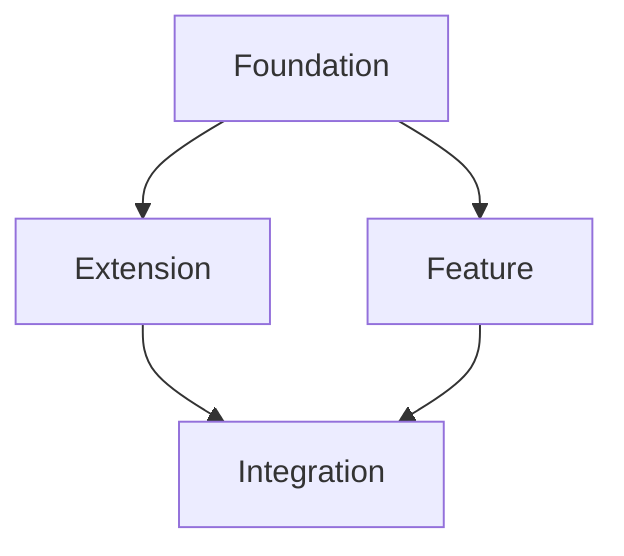

# Phase 3: Session Execution & Weekly Cycle

## Overview

**Goal:** Execute sprint missions through single-session workflow, with automated handoffs between missions and a systematic weekly cycle.

Phase 3 is where your planning becomes working software. You'll execute missions one session at a time, with the AI automatically updating documentation for seamless transitions. At the end of each sprint, you'll review progress and loop back to update your roadmap for the next sprint.

---

## Prerequisites

Before starting Phase 3, you must have:

- [ ] Completed Phase 2 (current sprint missions planned and documented)
- [ ] `/missions/sprint-XX/` folder structure exists
- [ ] All mission files created (R#.# and/or B#.#)
- [ ] First mission is ready to execute

---

## Phase 3 Overview

Phase 3 consists of three interconnected processes:

1. **Initial Sprint Setup** - Set up tracking files for the sprint (one-time per sprint)
2. **Session Execution** - Execute individual missions with automated handoffs (repeats per mission)
3. **Weekly Cycle** - Complete sprint, review roadmap, plan next sprint (repeats per sprint)

```
┌───────────────────────────────────────────────────────┐
│  Phase 1: Foundation (roadmap + architecture)       │
└──────────────────┬────────────────────────────────────┘
                   │
                   ▼
┌───────────────────────────────────────────────────────┐
│  Phase 2: Mission Planning (sprint missions)        │
└──────────────────┬────────────────────────────────────┘
                   │
                   ▼
┌───────────────────────────────────────────────────────┐
│  Phase 3: Session Execution                         │
│  ┌───────────────────────────────────────────────┐  │
│  │  1. Initial Sprint Setup (one-time)           │  │
│  └───────────────────────────────────────────────┘  │
│                    │                                 │
│                    ▼                                 │
│  ┌───────────────────────────────────────────────┐  │
│  │  2. Session Execution Loop                    │  │
│  │     - Execute mission                         │  │
│  │     - AI updates files for next mission       │  │
│  │     - Human verifies and continues            │  │
│  │     (Repeats for each mission in sprint)      │  │
│  └───────────────────────────────────────────────┘  │
│                    │                                 │
│                    ▼                                 │
│  ┌───────────────────────────────────────────────┐  │
│  │  3. Weekly Cycle                              │  │
│  │     - Sprint complete                         │  │
│  │     - Review roadmap (Phase 1)                │  │
│  │     - Plan next sprint (Phase 2)              │  │
│  │     - Loop back to Session Execution          │  │
│  └───────────────────────────────────────────────┘  │
└───────────────────────────────────────────────────────┘
```

---

## Part 1: Initial Sprint Setup

This is done **once per sprint** before executing any missions.

### Step 1: Create Sprint Tracking Files

You'll update four core tracking files that enable automated handoffs:

1. **`/missions/backlog.yaml`** - Sprint-level mission tracking
2. **`/missions/current.yaml`** - Current mission details and handoff instructions
3. **`/PROJECT_CONTEXT.json`** - Machine-readable project state
4. **`/AI_HANDOFF.md`** - Human-readable session context

**Action Items:**
- [ ] Create `/missions/backlog.yaml` if it doesn't exist
- [ ] Create `/missions/current.yaml` if it doesn't exist
- [ ] Create `/PROJECT_CONTEXT.json` if it doesn't exist
- [ ] Create `/AI_HANDOFF.md` if it doesn't exist

### Step 2: update Backlog

The backlog captures all missions for the current sprint at a glance.

**Create `/missions/backlog.yaml`:**

```yaml
# backlog.yaml - Sprint Plan Metadata
name: "Planning.SprintPlan.v1"
version: "1.0.0"
displayName: "Sprint Plan Orchestrator"
description: "Master backlog tracking all sprints, missions, and dependencies"
author: "Your Name/Team"
schema: "./schemas/SprintPlan.v1.json"

---

# Mission File: project-main-backlog.yaml

missionId: "SP-MAIN-001"

objective: "To successfully track, manage, and complete all planned development sprints from foundation through final delivery."

context: |
  This mission file represents the master backlog and sprint plan for the [Your Project Name] project.
  It provides a single source of truth for what has been completed, what is in progress, and what is planned.
  This structured format allows for automated status tracking and dependency management.

successCriteria:
  - "All missions within the current sprint are moved through 'Current' to 'Completed' status."
  - "Sprint transitions are properly documented with learnings captured."

deliverables:
  - "A fully updated version of this mission file with accurate sprint and mission status."

domainFields:
  type: "Planning.SprintPlan.v1"

  sprints:
    # Completed Sprints (example structure)
    - sprintId: "Sprint 1"
      title: "Foundation - [Your Sprint Theme]"
      focus: "[Brief description from roadmap]"
      status: "Completed"
      missions:
        - { id: "B1.1", name: "[Component Name]", status: "Completed" }
        - { id: "B1.2", name: "[Component Name]", status: "Completed" }
        - { id: "B1.3", name: "[Component Name]", status: "Completed" }

    # Current Sprint
    - sprintId: "Sprint N"
      title: "[Sprint Theme]"
      focus: "[Brief description from roadmap]"
      status: "In Progress"
      missions:
        - { id: "BN.1", name: "[Component Name]", status: "Current" }
        - { id: "BN.2", name: "[Component Name]", status: "Queued" }
        - { id: "BN.3", name: "[Component Name]", status: "Queued" }

    # Future Sprints
    - sprintId: "Sprint N+1"
      title: "[Next Sprint Theme]"
      focus: "[Brief description from roadmap]"
      status: "Planned"
      missions:
        - { id: "BN+1.1", name: "[Component Name]", status: "Planned" }
        - { id: "BN+1.2", name: "[Component Name]", status: "Planned" }

  # Mission Dependencies
  missionDependencies:
    - { from: "BN.1", to: "BN.2", type: "Blocks" }
    - { from: "BN.1", to: "BN.3", type: "Blocks" }
    - { from: "BN.2", to: "BN.4", type: "Blocks" }
    - { from: "BN.3", to: "BN.4", type: "Blocks" }

  # Sprint Success Metrics
  successMetrics:
    - "[Key metric from roadmap]"
    - "[Key metric from roadmap]"
    - "[Key metric from roadmap]"
```

**Key Points:**
- List ALL current sprint missions
- Mark completed missions with status "Completed"
- Mark first build mission as status "Current"
- Keep other missions as status "Queued"
- Include success metrics from roadmap

**Action Items:**
- [ ] Copy template above to `/missions/backlog.yaml`
- [ ] Fill in current sprint mission details from Phase 2
- [ ] Add mission dependency relationships
- [ ] List success metrics from roadmap.md


### Step 3: Initialize PROJECT_CONTEXT.json

This machine-readable file enables AI to track project state across sessions.

**Create `/PROJECT_CONTEXT.json`:**

```json
{
  "project_name": "[Your Project Name]",
  "version": "1.0.0",
  "created": "YYYY-MM-DD",
  "last_updated": "YYYY-MM-DD",
  
  "working_memory": {
    "active_domain": "[domain for first mission]",
    "session_count": 1,
    "last_session": "YYYY-MM-DD-sprint-N-start"
  },
  
  "domains": {
    "[domain_name]": {
      "status": "active",
      "priority": 1,
      "current_mission": "BN.1",
      "missions": {
        "BN.1": {
          "name": "[Mission Name]",
          "status": "in_progress",
          "started": "YYYY-MM-DD",
          "target_completion": "[estimated sessions]"
        },
        "BN.2": {
          "name": "[Mission Name]",
          "status": "queued"
        }
      },
      "critical_facts": [
        "[Key technical decision]",
        "[Performance target]",
        "[Constraint]"
      ],
      "constraints": [
        "[Technical constraint]",
        "[Resource constraint]"
      ],
      "decisions_made": [],
      "files_to_create": [
        "path/to/file1.ts",
        "path/to/file2.ts"
      ],
      "research_completed": [
        "missions/sprint-XX/research/RN.1_[topic].yaml"
      ],
      "achievements": []
    }
  },
  
  "mission_planning": {
    "current_mission": {
      "id": "BN.1",
      "name": "[Mission Name]",
      "sprint": "N",
      "status": "ready",
      "context_files": [
        "PROJECT_CONTEXT.json",
        "AI_HANDOFF.md",
        "missions/current.yaml"
      ],
      "research": [
        "missions/sprint-XX/research/RN.1_[topic].yaml"
      ],
      "deliverables": [
        "[Key deliverable 1]",
        "[Key deliverable 2]"
      ]
    },
    "next_mission": {
      "id": "BN.2",
      "name": "[Next Mission]",
      "status": "queued"
    },
    "current_sprint_missions": {
      "BN.1": {
        "name": "[Mission Name]",
        "status": "in_progress",
        "priority": 1
      },
      "BN.2": {
        "name": "[Mission Name]",
        "status": "queued",
        "priority": 2
      }
    }
  },
  
  "current_sprint": {
    "sprint": "N",
    "phase": "Sprint N: [Theme]",
    "active_mission": "BN.1: [Mission Name]",
    "completed_missions": [],
    "queued_missions": [
      "BN.2: [Name]",
      "BN.3: [Name]"
    ],
    "blockers": [],
    "next_milestone": "Sprint N+1: [Next Theme]"
  },
  
  "ai_instructions": {
    "context_priority": [
      "missions/current.yaml",
      "AI_HANDOFF.md",
      "PROJECT_CONTEXT.json"
    ],
    "special_instructions": [
      "Follow completionProtocol in current.yaml exactly",
      "Update all 4 files before marking mission complete"
    ]
  }
}
```

**Action Items:**
- [ ] Create `/PROJECT_CONTEXT.json` using template above
- [ ] Fill in project name and dates
- [ ] Add domain information from technical_architecture.md
- [ ] List all current sprint missions
- [ ] Verify JSON is valid (use a JSON validator)


## Context for AI Assistant

### Project Architecture

[Brief summary from technical_architecture.md]

### What Already Exists
- ✅ Foundational documents (roadmap, technical architecture)
- ✅ Current sprint mission planning (Phase 2 complete)
- ✅ Research (if completed): [list research missions]

### Current Sprint Mission Sequence

1. **BN.1** (Current): [Name] - [Brief description]
2. **BN.2** (Next): [Name] - [Brief description]
3. **BN.3**: [Name] - [Brief description]
[Continue for all missions]

### Key Patterns/Decisions

[Any architectural patterns or decisions from technical_architecture.md]

---

## Sprint Context

**Sprint Theme**: [From roadmap]  
**Total Missions**: [Number]  
**Sprint Success**: [Overall sprint goal from roadmap]

**Mission Dependencies**:


---

*Mission BN.1 Ready to Start*  
*Sprint N Session 1*  
*Updated: [Today's Date]*
```

**Action Items:**
- [ ] Fill in project and sprint context
- [ ] Add current mission details
- [ ] Include mission sequence and dependencies

### Step 6: Verify Initial Setup

Before executing your first session, verify all files are correct.

**Verification Checklist:**

- [ ] `/missions/backlog.yaml` exists and shows BN.1 as status "Current"
- [ ] `/PROJECT_CONTEXT.json` exists and is valid JSON
- [ ] All file paths reference actual mission files in `/missions/sprint-XX/`
- [ ] completionProtocol is at end of each mission
- [ ] No placeholder text like [FILL IN] or TODO

**Validation Commands:**

```bash
# Verify file existence
ls missions/backlog.yaml missions/current.yaml PROJECT_CONTEXT.json 

# Validate JSON
node -e "JSON.parse(require('fs').readFileSync('PROJECT_CONTEXT.json'))"
# Should show no errors

# Validate YAML
npx js-yaml missions/backlog.yaml
# Should show no errors

# Check for placeholders
grep -r "\[FILL\|TODO\|XXX" missions/backlog.yaml missions/current.yaml AI_HANDOFF.md
# Should return nothing
```

---

## Part 2: Session Execution

This process repeats for **each mission** in the sprint.

### The Session Execution Loop

Each mission follows this pattern:

```
1. AI is prompted to begin, starts by reading cmos/missions/backlog.yaml and finds the current mission 
3. AI executes mission and creates deliverables
4. AI updates all 2 files per prompt
5. Human verifies updates and deliverables, re-runs test or examples as needed to verify work
6. Loop: Next mission is ready in current.yaml
```

### Step 1: Prepare for Session

**Action Items:**

- [ ] Check `/PROJECT_CONTEXT.json` for state
- [ ] Verify dependencies from previous missions are complete

### Step 2: Start AI Session

**Provide AI with context:**

```
Human gives prompt:" Open cmos/missions/backlog.yaml (source of truth for the sprint). Use statuses exactly: Queued → Current → In Progress → Completed (and Blocked when needed).

Select the next target: prefer the first In Progress; otherwise the first Current; otherwise the first Queued and immediately set it to In Progress.

Start log: append one JSON line to cmos/SESSIONS.jsonl (root) with ISO time, agent, mission id, "action":"start", and "status":"in_progress". Example keys: ts, agent, mission, action, status, summary.

Run the mission.

On completion:

In cmos/missions/backlog.yaml mark the mission Completed and set completed_at: <ISO time> plus a one-line notes.

Promote the next Queued mission to Current (or directly In Progress if you want immediate execution).

Append a completion event to cmos/SESSIONS.jsonl with "action":"complete", "status":"completed", and next_hint if applicable. Keep the file append-only.

Update cmos/PROJECT_CONTEXT.json: increment working_memory.session_count, update working_memory.last_session, and, if you track a pointer, set the last/active mission id. Keep this file small and factual.

If blocked:

Set mission status Blocked in cmos/missions/backlog.yaml with a short reason and what’s needed.

Append a "action":"blocked" event to **SESSIONS.jsonl" with needs:[...].

Do not promote a new mission until unblocked.

Optional: write a tiny outcome: block at the bottom of the mission file (cmos/status/summary/) for self-containment; do not duplicate backlog details."
```

**If using research:**
make sure that the research is cross linked and the instructions clearly say to read or reference lines [ ]


### Step 3: AI Executes Mission

The AI will:
1. Read all context files
2. Implement the mission deliverables
3. Run tests/validation
4. Update all 3 files per completionProtocol:
   - `cmos/missions/backlog.yaml` - Mark complete, set next as current   
   - `cmos/PROJECT_CONTEXT.json` - Update session count, mission status
   - `cmos/SESSIONS.jsonl` - Add completion, set next mission context

### Step 4: Verify Mission Completion

**Human verification checklist:**

**Code Deliverables:**
- [ ] All files in deliverables list created
- [ ] Tests pass successfully
- [ ] Performance targets met (if applicable)
- [ ] Code follows project patterns

**Documentation Updates:**
- [ ] `cmos/missions/backlog.yaml` - Current mission status "Completed", next marked "Current"
- [ ] `cmoos/PROJECT_CONTEXT.json` - Session count incremented, missions updated

**Verification Commands:**

```bash
# Run tests
npm test  # or equivalent for your project

# Validate files
node -e "JSON.parse(require('fs').readFileSync('cmos/PROJECT_CONTEXT.json'))"
npx js-yaml cmos/missions/backlog.yaml
npx js-yaml cmos/missions/current.yaml

# Check file updates
git diff cmos/missions/backlog.yaml cmos/PROJECT_CONTEXT.json 

# Verify next mission is ready
grep "status: Current" cmos/missions/backlog.yaml
head -30 cmos/missions/current.yaml
```

### Step 5: Continue or Pause

**If continuing to next mission immediately:**
- [ ] current.yaml now contains next mission (BN.2)
- [ ] Return to Step 1 with new mission

**If pausing:**
- [ ] Commit changes if using version control
- [ ] missions/current.yaml contains next mission ready to resume
- [ ] When resuming, start at Step 1

### Session Execution Example

**Before Session (missions/current.yaml shows BN.1):**
```yaml
missionId: "BN.1-YYYYMMDD-001"
objective: "Build core parser component"
# ... mission details ...
completionProtocol:
  description: "When complete, update all tracking files"
  # ... protocol details ...
```

**After Session (missions/current.yaml now shows BN.2):**
```yaml
missionId: "BN.2-YYYYMMDD-001"
objective: "Extend parser with advanced features"
# ... next mission details ...
completionProtocol:
  description: "When complete, update all tracking files"
  # ... protocol details ...
```

**Updated backlog.yaml:**
```yaml
missions:
  - { id: "BN.1", name: "Core Parser", status: "Completed" }
  - { id: "BN.2", name: "Parser Extensions", status: "Current" }
  - { id: "BN.3", name: "Integration Layer", status: "Queued" }
```

**The loop continues:** Next session starts with BN.2 already loaded in current.yaml.

---

## Part 3: Weekly Cycle (Sprint Completion)

At the end of the current sprint (when all missions are complete), you'll review progress and loop back to Phase 1.

### Sprint Completion Criteria

Sprint is complete when:

- [ ] All missions in `cmos/missions/backlog.yaml` marked status "Completed"
- [ ] All success metrics from backlog achieved
- [ ] All tests passing
- [ ] Sprint deliverables functional

### Step 1: Generate Sprint Summary


**This used to be AI handoff but we sunset this because it was overhead and inconsistency updated causing problems:**

```markdown
## Sprint N Complete! ✅

### All Sprint Missions Delivered
- ✅ **BN.1**: [Mission Name]
  - [Key achievement]
- ✅ **BN.2**: [Mission Name]
  - [Key achievement]
- ✅ **BN.3**: [Mission Name]
  - [Key achievement]
[All missions listed]

### Sprint Summary

**Total Deliverables:**
- [X] production files created
- [Y] passing tests
- Test coverage: [percentage or description]
- Performance targets: [met/exceeded]

**Key Achievements:**
1. [Major achievement 1]
2. [Major achievement 2]
3. [Major achievement 3]

**Technical Decisions Made:**
1. [Decision 1 with rationale]
2. [Decision 2 with rationale]

**Blockers Encountered:**
- [Blocker 1 and resolution]
- [Blocker 2 and resolution]

**Learnings for Next Sprint:**
- [Learning 1]
- [Learning 2]
```

**Action Items:**
- [ ] Review AI_HANDOFF.md for completeness
- [ ] Add any final sprint notes
- [ ] Ensure all achievements documented
- [ ] Document any blockers or learnings

### Step 2: Review Roadmap (Back to Phase 1)

Use your sprint summary to review and update your roadmap.

**Review Questions:**

1. **Did this sprint achieve its goals?**
   - Compare deliverables to roadmap.md sprint section
   - Were success metrics met?
   - Any significant deviations?

2. **Does the roadmap still make sense?**
   - Based on learnings, should next sprint change?
   - New blockers or risks discovered?
   - Timeline adjustments needed?

3. **Is additional research needed?**
   - Did this sprint reveal unknowns?
   - Technical decisions that need validation for next sprint?

**Action Items:**
- [ ] Open `cmos/docs/roadmap.md`
- [ ] Mark current sprint as complete
- [ ] Update sprint section with actual results
- [ ] Review next sprint plan - does it still make sense?
- [ ] Adjust next sprint scope/approach if needed
- [ ] Update success metrics based on learnings
- [ ] Document any roadmap changes with rationale

**Example Roadmap Update:**

```markdown
## Sprint N: [Theme] ✅ COMPLETE
**Planned:** [Original plan from roadmap]
**Actual:** [What was actually delivered]

### Completed Missions
- [x] BN.1: [Mission Name]
- [x] BN.2: [Mission Name]
- [x] BN.3: [Mission Name]
- [x] BN.4: [Mission Name]

### Results
- ✅ All planned features delivered
- ✅ Performance targets exceeded
- ⚠️ Discovered need for [adjustment]
- ✅ Test coverage: [percentage]

### Learnings
- [Key learning 1]
- [Key learning 2]
- [Adjustment made]

## Sprint N+1: [Next Theme] (NEXT)
**Adjusted Plan:** [Updated plan based on learnings]

[Updated next sprint plan]
```

### Step 3: Decide on Next Sprint

**Three possible paths:**

**Path A: Continue to Next Sprint as Planned**
- Roadmap next sprint is still valid
- No major blockers discovered
- Proceed to Phase 2 with next sprint

**Path B: Inject Research Sprint IF**
- Current sprint revealed unknowns
- Technical decisions need validation
- Create research sprint before next build sprint

**Path C: Adjust Next Sprint Scope**
- Current sprint took longer/shorter than expected
- New priorities emerged
- Update roadmap, then proceed to Phase 2

**Decision Framework:**

```
┌─ Sprint Complete ─┐
│                   │
│ Review Roadmap    │
│                   │
└──────┬────────────┘
       │
       ▼
   ┌───────────────────────────┐
   │ Next sprint still valid?  │
   └──┬────────────────────┬───┘
      │                    │
     YES                  NO
      │                    │
      ▼                    ▼
   ┌────────────┐     ┌──────────────┐
   │ Proceed to │     │ Update       │
   │ Phase 2 →  │     │ roadmap.md   │
   │ Next Sprint│     │ and/or       │
   │            │     │ architecture │
   └────────────┘     └──────┬───────┘
                             │
                             ▼
                      ┌─────────────────┐
                      │ Research needed?│
                      └────┬───────┬────┘
                           │       │
                          YES     NO
                           │       │
                           ▼       ▼
                      ┌────────────────┐
                      │ Proceed to     │
                      │ Phase 2 with   │
                      │ adjusted plan  │
                      └────────────────┘
```

**Action Items:**
- [ ] Decide which path: Continue, Research, or Adjust
- [ ] Update roadmap.md if needed
- [ ] Update technical_architecture.md if needed
- [ ] Document decision rationale

### Step 4: Plan Next Sprint (Back to Phase 2)

Once roadmap is confirmed/updated, return to Phase 2 to plan next sprint missions.

**Action Items:**
- [ ] Create `cmos/missions/sprint-XX/` folder structure (increment sprint number)
- [ ] Create research missions if needed (RX.#)
- [ ] Create build missions (BX.#)
- [ ] Follow Phase 2 process for next sprint

### Step 5: Begin Next Sprint Execution

With next sprint missions planned, return to Part 1 of Phase 3 (Initial Sprint Setup).

**Action Items:**
- [ ] Update `cmos/missions/backlog.yaml` with next sprint missions
- [ ] Create new `cmos/missions/current.yaml` for first mission of next sprint
- [ ] Update `cmos/PROJECT_CONTEXT.json` for next sprint
- [ ] Update `cmos/AI_HANDOFF.md` with next sprint context
- [ ] Execute next sprint missions following Part 2 process

---

## The Complete Cycle

```
Phase 1: Foundation
    ↓
Phase 2: Mission Planning (Sprint N)
    ↓
Phase 3: Initial Sprint Setup (Part 1)
    ↓
Phase 3: Execute Missions (Part 2) ←──┐
    │                                  │
    │ (Repeat for each mission)        │
    └──────────────────────────────────┘
    ↓
Phase 3: Sprint Complete (Part 3)
    ↓
Phase 1: Review Roadmap (update if needed)
    ↓
Phase 2: Mission Planning (Sprint N+1)
    ↓
Phase 3: Initial Sprint Setup (Sprint N+1)
    ↓
Phase 3: Execute Missions (Sprint N+1) ←──┐
    │                                      │
    │ (Repeat for each mission)            │
    └──────────────────────────────────────┘
    ↓
[Continue until project complete]
```

---

## Tips for Effective Session Execution

### Automate the Handoff


### Keep Sessions Focused

- Execute one mission per session
- Don't combine missions unless they're very small (<10k tokens)
- Let the completionProtocol handle the handoff

### Verify Before Continuing

Always verify the 4 file updates before starting the next session. A small error compounds across sessions.

### Use Version Control

Commit after each mission completion. This creates rollback points and clear history.

```bash
git add .
git commit -m "Complete BN.X: [Mission Name]"
```

### Track Sessions (Optional)

The SESSIONS.jsonl file is optional but useful for metrics:

```bash
# View session history
cat SESSIONS.jsonl | jq .

# Count completed missions
cat SESSIONS.jsonl | jq -r .mission | sort | uniq | wc -l

# Calculate average tokens per mission
cat SESSIONS.jsonl | jq '.tokens_in + .tokens_out' | awk '{sum+=$1} END {print sum/NR}'
```

### Handle Blockers

If a mission reveals a blocker:

1. **Document it** in current mission notes
2. **Don't skip** - resolve or adjust
3. **Update roadmap** if it affects future sprints
4. **Create research mission** if technical validation needed
5. **Adjust mission scope** if needed (split into smaller missions)

### Maintain Momentum

The system is designed for daily execution:
- Morning: Execute 1-2 missions
- Afternoon: Execute 1-2 more missions
- End of day: Review progress

Adjust cadence to your capacity, but consistency matters more than speed.

---

## Common Pitfalls

### Pitfall 1: Skipping Completion Protocol

**Problem:** AI completes mission but doesn't update files.  
**Impact:** Next session has no context, requires manual setup.  
**Solution:** Ensure completionProtocol is in current.yaml, verify updates.

### Pitfall 2: Not Verifying File Updates

**Problem:** Trust AI updates without checking.  
**Impact:** Errors compound across sessions.  
**Solution:** Always run verification commands before continuing.

### Pitfall 3: Combining Too Many Missions

**Problem:** Try to execute multiple missions in one session to save time.  
**Impact:** Exceeds token budget, incomplete work, unclear handoffs.  
**Solution:** One mission per session. Trust the process.

### Pitfall 4: Ignoring Sprint Summary

**Problem:** Complete sprint, immediately start next without review.  
**Impact:** Miss learnings, repeat mistakes, roadmap becomes stale.  
**Solution:** Always review roadmap between sprints, update based on learnings.

### Pitfall 5: Not Updating Roadmap

**Problem:** Roadmap diverges from reality over time.  
**Impact:** Loss of strategic direction, poor planning.  
**Solution:** Treat roadmap as living document, update after each sprint.

---

## Phase 3 Complete

You've successfully completed Phase 3 when:

- [ ] All missions in current sprint executed
- [ ] Sprint summary documented in AI_HANDOFF.md
- [ ] Roadmap reviewed and updated
- [ ] Next sprint planned (Phase 2)
- [ ] Ready to execute next sprint (loop back to Part 1)

**The CMOS cycle continues:** Each sprint builds on the previous, with systematic review and adjustment at each transition.

---

## Quick Reference

### Files That Enable Automation

1. **missions/backlog.yaml** - Sprint-level tracking
2. **missions/current.yaml** - Session instructions + completionProtocol
3. **PROJECT_CONTEXT.json** - Machine-readable state
4. **AI_HANDOFF.md** - Human-readable context

### Key Automation Trigger

The **completionProtocol** section at the end of `current.yaml` tells the AI exactly how to update all files for seamless handoff.

### Session Execution Commands

```bash
# Before session
ls missions/current.yaml AI_HANDOFF.md PROJECT_CONTEXT.json

# After session - verify
npm test
node -e "JSON.parse(require('fs').readFileSync('PROJECT_CONTEXT.json'))"
npx js-yaml missions/backlog.yaml
npx js-yaml missions/current.yaml
git diff

# Commit
git add .
git commit -m "Complete [mission-id]: [mission-name]"
```

### Sprint Transition Checklist

- [ ] All missions complete
- [ ] Sprint summary in AI_HANDOFF.md
- [ ] Review roadmap.md
- [ ] Update roadmap if needed
- [ ] Plan next sprint (Phase 2)
- [ ] Set up next sprint files (Phase 3 Part 1)

---

*Phase 3 enables rapid, systematic execution with minimal friction and maximum continuity.*